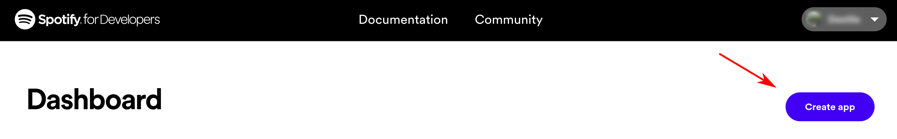
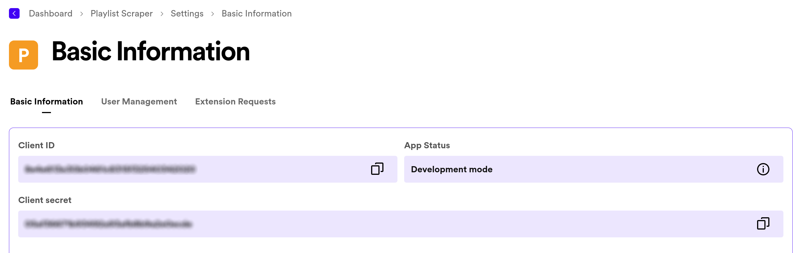
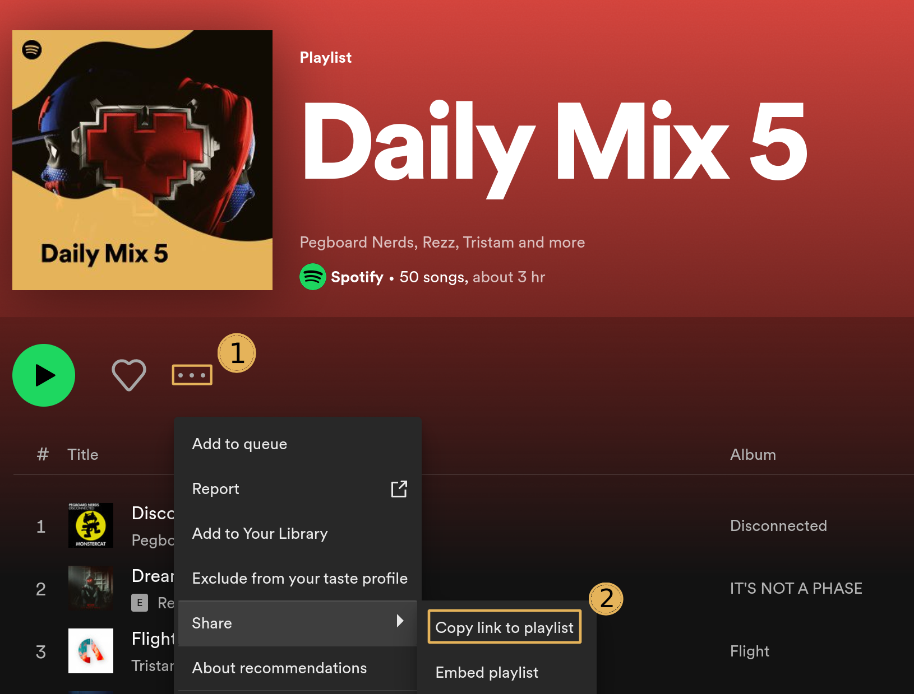

# Download Scraped Spotify Playlists 
Script capable of downloading Spotify playlists on Youtube and turn them into mp3s.

## Getting Started
You will need to have Python installed to run the script
If not go to this link: [How to install Python on Windows, Mac and Linux](https://kinsta.com/knowledgebase/install-python/)

### Python Modules
You will need to install the pytube, spotipy, moviepy, and dotenv modules to properly run the script.

**Install:**
- Pytube: `pip install pytube`
- Spotipy: `pip install spotipy --upgrade`
- Moviepy: `pip install moviepy`
- Dotenv: `pip install python-dotenv`
 

## Setting Up the Spotiy Web API
Before running the script you must register the application and get credential access to the Spotify Web API. The necessary credentials will be added to the `.env` file.

1. #### Log in to the Spotify Developer Portal

	 Navigate to the [Spotify developer portal](https://developer.spotify.com/dashboard) and login using your normal Spotify username and password.
	 You can create a new account if you don't have one
	
 	***NOTE:*** You don't need a paid subscription to access the API, 'free' account users can still use it.
2. #### Create a new app

	Create a new app in the dashboard to generate the API credentials.
	
 	

3. #### Get your credentials

	In your newly created app, click on **settings**. This will take you to the **Basic Information** tab. There you will see your 'Client ID'. Under it click **view client secret** and this will show you your 'Client Secret'.

	

5. #### Setup .env file

	You will need to copy your 'Client ID' and 'Client Secret' and paste them in the provided .env file.

	```
	 # .env example
	CLIENT_ID='your_client_id'
	CLIENT_SECRET='your_client_secret
 	```
	
## The Script

### Script Details
Running `main.py` will start the script. 

The primary input for the program is a link to a playlist on Spotify. This can be found on the Spotify UI:



The script will then create a `csv` or `txt` file (under the user's discretion) containing the song and artist.

Following the creation of the file, the user will be prompted to give the name of the file they created. This will start the search mechanism of the script and initialize the download for each inidividual song. (Songs are downloaded as MP4s)

Finally, all downloaded songs will be converted to MP3 and the script will prompt the user to either delete or keep the MP4s after the conversion is done.

### Running the script:
- Windows: `python main.py`
- Linux and Mac: `python3 main.py`
